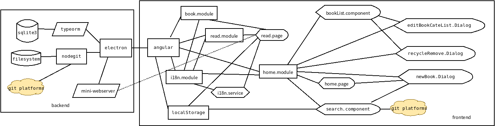
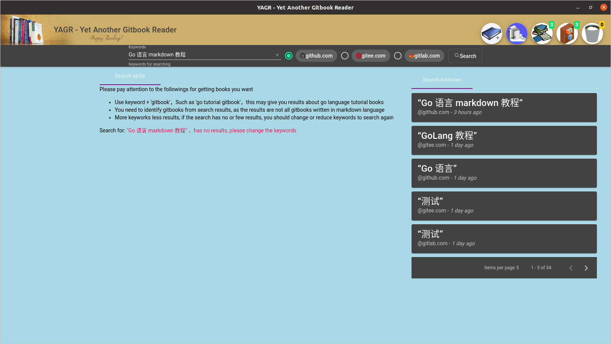

# YAGR - Yet Another Gitbook Reader

There are a lot of books resource written in markdown language on the Internet, you can find from GitHub, GitLab, Gitee... platforms, and most of these books are high quality tech documents. This project is based upon Eletron, Angular, TypeORM, UnifiedJS, NodeGit and other project, the target is a stable, easy to use gitbook reader.

You can Fork and contribute to this project.

网上基于 Markdown 的书籍很多，通常在GitHub、GitLab、Gitee等代码托管与社会化编程网站上都能找到，其中大部分都是高质量的技术文档。本项目基于Electron、Angular、UnifiedJS等既有框架，目标是得到一个稳定、易于使用的Gitbook阅读器。

本项目使用了 `nodegit`, `typeorm`, `electron`, `angular`, `@swimlane/docspa-core` 等项目/代码。

## 开发日志/Dev Logs

+ 2021-1-12

    - With `@ngx-translate/core` and `@ngx-translate/http-loader`, now this project supports multilingual UI
    + Todos:
        - Optimize I18n
        - List books under categories

+ 2021-1-8

    - 完善了搜索界面、阅读器界面
    - 重写了Electron 后端，实现 CRUD 实例的重用，从而改善了性能，并将数据库文件调整到 `appDir` 目录
    - 尚未完成：按类别、作者、平台过滤书籍，后期建立账号系统

+ 2021-1-2

    - 完成从GitHub，GitLab，Gitee三大平台获取书籍元数据特性
    - 优化作者 avatar 获取

+ 2020-12-31

    - 2020的最后一天
    - 准备从 GitHub, Gitee, Gitlab获取书籍信息
    - 已经准备好 `fetch.service.ts`, 其中涉及 `Restful API`，`HttpHeaders`等内容

+ 2020-12-29

    - 重写了`loadSummary`，增加了`remark` 的 `correctHeadings` 插件
    - 实现了阅读记录删除，现在可以彻底删除书籍了（之前因为阅读记录关联了书籍id，而不能彻底删除书籍）
    - 尚待实现：从 Github 等处获取书籍、查看作者/类别/代码仓库下的书籍

+ 2020-12-26

    - 增加“阅读记录”功能
    - 修改 `src/app/read/read.page.ts` 等多处，以适配“阅读记录”
    - 尚需实现“阅读”进入上次阅读地点，`loadSummary` 方法还没有重写

+ 2020-12-24

    - 改写前端，实现“正在看的书”、“书架上的书”和“暂存在回收站的书”的分离，并加入视觉反馈
    - 从`src/app/home/home.page.ts`、`src/app/home/components/book-list.component.ts`中分离出`book`、`writer`、`website`、`category`等数据模型的业务逻辑，`home.page.ts`与`book-list.component.ts`只负责视图控制，他们的行数变得更少，实现了较大重构，代码更清晰，后期功能增加就变得容易可行了
    - 尝试从 github.com 的 `search API` 获取书籍，搜索参数为 `search?q="gitbook"+"python"+filename:SUMMARY.md&type=Repositories`
    - 尝试修改 `loadSummary` 方法，重新实现从 `SUMMARY.md` 加载目录，而不是从后台扫描的 `md list` 加载目录

+ 2020-12-21

    - 调整UI，加入打开 README.md
    - 修改 `src/app/book/markdown/markdown.service.ts`，`src/app/book/markdown-elements/embed-file.ts`与`src/app/book/shared/links.ts`，将`home.page`中打开的README.md中的内部链接去除

+ 2020-12-20

    - 已经完善了书籍类别修改
    + 再次尝试Windows下的编译，得到以下认知：

        - `node-gyp`, gyp, generate your projects, 藉由Python对原生Node模块进行跨平台编译，在不同平台调用不同的构建工具（Linux GCC、Windows MSVS Build, macOS Xcode）
        - 往编译器传递参数，是通过模块根目录下的`binding.gyp`构建配置文件完成的，可编辑此文件，修改编译参数
        - 之前遇到的`nodegit`原生模块编译问题，找不到`openssh`的诸多头文件，就可以通过修改`binding.gyp`配置文件加以解决
        - `nodegit`模块本身就带有获取`openssh`库和头文件的实用工具（`node_modules/nodegit/utils/acquireOPENSSL.js`, 运行命令` node ./node_modules/nodegit/utils/acquireOpenSSL.js`既可获取到OpenSSL, 在`vendor`目录下），无需额外安装或编译`openssh`!!!
        - 现在遇到了在编译完成生成动态链接库时，`libssh2`报错的问题，预计可再次修改`binding.gyp`加以解决
        - `libssh2.lib(channel.obj) : error LNK2019: unresolved external symbol RAND_bytes`, `libssh2.lib(channel.obj) : error LNK2001: 无法解析的外部符号 RAND_bytes`等` fatal error LNK1120: 140 个无法解析的外部命令`......, 上述修改`binding.gyp` 仍无法解决，现参考 [Libssh2 LINKER errors](https://github.com/libssh2/libssh2/issues/191)，加以解决

+ 2020-12-17

    - 在实现书籍删除时，遇到新下载书籍无法删除的问题，`mat-dialog`模板数据未能绑定
    - 考虑进一步优化`home.page`界面
    - `remark-gfm` 提示要升级 `remark` 到 `13`

+ 2020-12-16

    - 重写Electron后端，将书籍管理放入 `book.backend.ts`的类中
    - 将Electron的`index.ts`修改为类的形式
    - 给图片重新加上了`findup`方法，将`images`插件修改为异步方式，实现图片自动查找
    - 发现`router.service.ts`中的判断 `homepage` 方法有问题，加以修改
    - 修正了 `src/app/book/markdown-elements/toc-pagination.component.ts`中的几个问题，分页正常工作
    - 修改 `src/app/book/services/search.service.ts` 与 `src/app/book/directives/content-search.directive.ts`，为 `search.service.ts`加上`init`方法，并在 `content-search.directive.ts`中调用，以解决首次搜索没有结果的问题
    - 继续实现书籍删除、类别编辑

+ 2020-12-12

    - 因为打包后无法再在 `src/assets` 中添加Git repo, 因此考虑使用Electron的`app.getPath('appDir')`文件夹来存放书籍Git repo，为了能在Angular中获取到Markdown、图片文件，故在Electron中`child_process.fork`出一个Mini web服务器
    - 修改Anuglar的`book`模块的`location.service.ts`服务，使得`book/markdown-elements/embed.ts`从本地服务器获取文件
    - 利用Electron的`session`模块，解决`CORS`报错问题
    - 后面尝试对 `electron/src/bookOps.ts`进行`fork`
    - 尚待完成书籍编辑、分类过滤、删除

+ 2020-12-11

    - 重写了 `router.service.ts`，解决了多处同名文件的bug。
    - 尚需实现 `home.page` 的书籍类别管理、删除书籍。

+ 2020-12-10

    - 重写 `loadSummary` 方法，由后端提供书籍的全部 `.md` 文件，提升加载速度。后期将 `summary-toc` 与 `search-index`在数据库中持久化，以进一步提升加载速度 
    - 正在解决 `toc-pagination.component.ts` 不能正常显示的问题

+ 2020-12-08(2)

    - 解决了在Electron中打开新窗口，加载Angular的路由问题!!!
    - Electron 应用的协议 `electron://-/`（`capacitor-electron://-/`） 表示根路径，其他路径都是 `capacitor-electron://-/#/home`这样的
    - 要在 `app.module.ts`中使用`HashLocationStrategy` 

+ 2020-12-08

    - 为了能在Electron的新窗口中打开Angular的路由，修改 `app-routing.module.ts`与`app.module.ts`，将`LocationStrategy`从`PathLocationStrategy`修改为`HashLocationStratedy`，以及一些其他修改
    - 修正了`book/services/location.service.ts`中判断是否为`shared` MD文件的方法，以及`shared`MD文件`vfile.data.gbr.url`生成的方式
    - 在修改了`LocationStrategy`后，由于路径中已经有了`#`符号，导致`toc`无法展开，现修改代码，解决`toc`展开的问题
    + `toc`展开机制：
        - `sectionScrollSpy` 指令获取到当前`article`在屏幕中的那些小节，发射输出到`read.page.ts`中
        - 两个`aside` 的 `listCollapse` 指令，从`read.page.ts`中获取到`sectionScrollSpy`生成的`active sections` 集合（`set`），对两个`aside`元素中的清单进行操作
        - 在变更了 `LocationStrategy` 后，原来的 `book/directives/list-collapse.directive.ts` 已经失效，需要进行修改

+ 2020-12-07

    - 前端界面已经优化的很不错了，阅读页面稳定，Home 页面简化成熟
    - 加入了NodeGit和Sqlite3两个原生模块，其中NodeGit用于克隆Markdown书籍，Sqlite3用于维护本地书籍数据
    - 两个原生模块都需要为当前Electron版本进行重新构建，为此要使用命令`npm i electron-rebuild --save-dev`安装`electron-rebuild`
    - 重新构建就是为当前特定版本的Electron重新编译模块的二进制版本，而不是使用该模块的预先构建版本
    - 模块的二进制发布，是一个二进制文件，包含了所有该模块的API接口，可供JavaScript, Python等语言进行调用，可以看着是一个`dll`文件
    - `node_module/.bin/`目录下，有很多到`node_module/xxx`模块命令的软连接(其中就有`electron`)，这个目录没有加入到系统的`$PATH`环境变量，只在本地`npm`环境下有效
    - `electron-rebuild`命令默认将重新编译所有的原生（native）模块，可使用其命令参数`-w --which`编译指定的模块

+ 2020-11-30

    - 已经支持多本书
    - 解决 github.io 部署时，`assets`下的 `.md` 文件 `404` 错误问题

+ 2020-11-21

    - 解决了打印问题、搜索问题，阅读器完全可用
    - 下一步着重开发Electron部分

+ 2020-11-21

    - 解决打印问题

+ 2020-11-20

    - 点击页面连接，页面没有更新，`RouterService`没有传入正确的 `changes`
    - 目录清单没有正确展开，`list-collapse.directive`没有正确工作
    - `section-spy.directive`有正确传出，但`list-collapse.directive`没有正确处理

